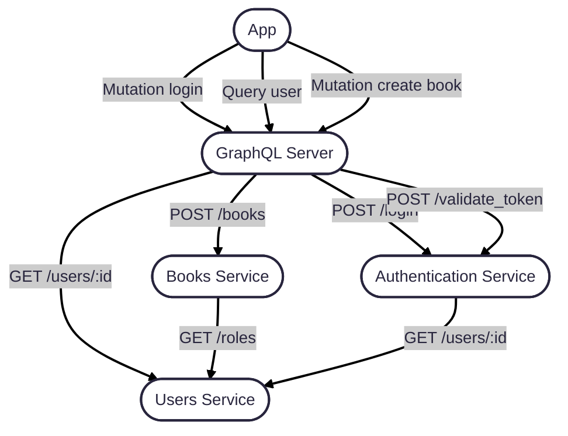

# RTC :world_map:

_Note: currently a work in progress_

Real Time Cartographer is a tool that enables developers to visualize their cloud infrastructure.

## Goal

The goal with this project is to generate a graph based off of the GCP log entries representing their architecture.

Here would be an example of a visual the graph database could potentially show.



## Local

### Requirements

1. docker-compose or podman
2. `rtc.toml` to configure (see `rtc.example.toml`)

### Building

```sh
cargo build
```

### Running

```sh
cargo run -- help
RUST_LOG=debug cargo run -- run
RUST_LOG=debug cargo run -- demo
```
